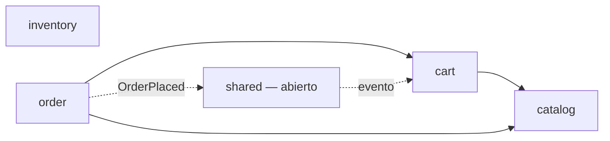

# tractor-store-backend

Backend de **The Tractor Store** (reto técnico Quind): un monolito modular en Spring Boot que
implementa el catálogo, inventario, carrito y pedidos descritos en la
[especificación de negocio](https://micro-frontends.org/tractor-store/). Consumido por el frontend
Angular del repo hermano `tractor-store-frontend`.

## Stack
Java 21 · Spring Boot 4.1 (Spring Framework 7) · Spring Modulith · Spring Data JPA + PostgreSQL 18 ·
Flyway · Spring Security · Spring Cache (Caffeine) · Micrometer + Prometheus + Grafana · Testcontainers.

## Arquitectura

Monolito modular con Spring Modulith: cada módulo es un paquete directo bajo `com.tractorstore`,
cerrado por defecto (solo lo declarado en su paquete raíz o expuesto vía `@NamedInterface` es visible
para otros módulos). `ModularityTests` (`ApplicationModules.verify()`) y `ArchitectureTest` (ArchUnit)
corren en cada build y fallan si algo rompe estas reglas.



- **catalog**: productos, variantes, categorías y tiendas. No depende de ningún otro módulo.
- **inventory**: stock disponible por SKU. Tampoco depende de otro módulo.
- **cart**: carrito por sesión HTTP (sin login). Lee `catalog` para enriquecer sus líneas.
- **order**: confirma pedidos con precio congelado. Lee `cart` (el carrito ya resuelto) y `catalog`
  (nombre/precio del producto), y publica el evento de dominio `OrderPlaced` en vez de llamar a `cart`
  directamente para vaciar el carrito tras el checkout — ver
  [`docs/adr/0002-eventos-de-dominio-antes-de-broker-externo.md`](docs/adr/0002-eventos-de-dominio-antes-de-broker-externo.md).
- **shared**: utilidades transversales (CORS, seguridad, cache, traceId, tipos de evento). Único
  módulo `OPEN`: los demás lo importan libremente.

Cada módulo separa `domain` (Java puro, sin Spring/JPA), `application` (casos de uso, puertos de
repositorio) e `infrastructure.persistence` (JPA, nunca visible fuera del propio módulo) por debajo de
su paquete raíz — así es como se cumple en la práctica el requisito de separar "api" de "internal".

Ver también:
[`docs/adr/0001-monolito-modular-y-no-microservicios.md`](docs/adr/0001-monolito-modular-y-no-microservicios.md),
[`docs/adr/0003-flyway-para-migraciones.md`](docs/adr/0003-flyway-para-migraciones.md).

## Endpoints

| Método | Ruta                          | Público |
| ------ | ----------------------------- | ------- |
| GET    | `/api/catalog/home`           | sí      |
| GET    | `/api/catalog/categories/{filter}` | sí (`all`/`classic`/`autonomous`) |
| GET    | `/api/catalog/products/{id}`  | sí      |
| GET    | `/api/catalog/recommendations?skus=` | sí |
| GET    | `/api/catalog/stores`         | sí      |
| GET    | `/api/inventory/{sku}`        | sí      |
| GET    | `/api/cart`                   | sí      |
| GET    | `/api/cart/mini`              | sí      |
| POST   | `/api/cart/items`              | sí      |
| DELETE | `/api/cart/items/{sku}`        | sí      |
| POST   | `/api/orders`                  | requiere sesión de carrito ya iniciada |
| GET    | `/api/orders/{id}`             | requiere sesión de carrito ya iniciada |

Con la app corriendo: Swagger UI en http://localhost:8080/swagger-ui.html, spec OpenAPI en
http://localhost:8080/v3/api-docs.

## Cómo correrlo localmente

**Desarrollo diario** (recarga rápida, debug desde el IDE):

```bash
./mvnw spring-boot:run
```

Levanta automáticamente PostgreSQL, Prometheus y Grafana como contenedores Docker (vía
`spring-boot-docker-compose` + `docker-compose.yml`) y arranca el backend en el host, en
`http://localhost:8080`, con el perfil `dev` (logging verboso, ver `application-dev.yml`).

**Stack completo con un solo comando** (backend también containerizado, perfil `prod`):

```bash
docker compose --profile full up --build
```

El servicio `backend` del `docker-compose.yml` usa el perfil de Compose `full` a propósito: así
`./mvnw spring-boot:run` no intenta levantar una segunda instancia del backend y pelear por el puerto
8080 contra la que ya corre en el host.

No se incluye Keycloak: el carrito es anónimo por sesión en vez de requerir un usuario autenticado,
así que no hay nada que Keycloak resuelva en este stack.

### Variables de entorno

| Variable | Default (perfil dev) | Uso |
| --- | --- | --- |
| `DATABASE_URL` | `jdbc:postgresql://localhost:5433/tractor_store` | conexión a PostgreSQL |
| `DATABASE_USERNAME` / `DATABASE_PASSWORD` | `tractor_store` / `tractor_store` | credenciales de PostgreSQL (solo válidas para desarrollo local; nunca usar en un despliegue real) |
| `CORS_ALLOWED_ORIGINS` | `http://localhost:4200` | orígenes permitidos para el frontend |
| `SPRING_PROFILES_ACTIVE` | `dev` | `dev` \| `prod` \| `test` |

## Cómo testearlo

```bash
./mvnw verify
```

Corre en una sola pasada: tests unitarios, tests de integración con Testcontainers (PostgreSQL real,
requiere Docker corriendo), `ArchitectureTest` (ArchUnit) y `ModularityTests`
(`ApplicationModules.verify()` de Spring Modulith). `./mvnw spotless:check` valida el formato
(google-java-format) por separado.

## Observabilidad

- Prometheus: http://localhost:9090 (scrapea `/actuator/prometheus` del backend, corra este en el
  host o containerizado).
- Grafana: http://localhost:3001 (acceso anónimo habilitado como Viewer; admin/admin si hace falta
  editar). El dashboard "Tractor Store Backend" se provisiona solo, con latencia p95, requests/s,
  errores 5xx y conexiones activas del pool de PostgreSQL.
- Para generar carga y ver las métricas moverse en vivo:
  `k6 run observability/load-test/smoke-test.js` (requiere [k6](https://k6.io/); usa
  `-e BASE_URL=...` si el backend no corre en `localhost:8080`).
- Cada request trae o genera un header `X-Trace-Id`, que queda en el MDC de todos los logs de esa
  request (`traceId`) para poder correlacionarlos. En el perfil `prod` los logs salen en JSON
  (formato ECS).
- El catálogo (productos, categorías, stores) se cachea 1 hora en memoria (Caffeine) — ver métrica
  `cache_gets_total{cache="catalog"}` en Prometheus para confirmar que los hits a PostgreSQL bajan
  tras la primera carga.

## CI

`.github/workflows/ci.yml`: lint (Spotless) → tests + ArchUnit + Modulith verify (`./mvnw verify`) →
build de la imagen Docker. Corre en cada push/PR a `main` y `develop`. Además,
`.github/workflows/sonarcloud.yml` corre el análisis de SonarCloud en cada push a `main` y cada PR.

## Cómo desplegarlo

Ver [`DEPLOYMENT.md`](DEPLOYMENT.md) para la guía completa de despliegue en Railway (Postgres
administrado, variables de entorno, healthcheck).
